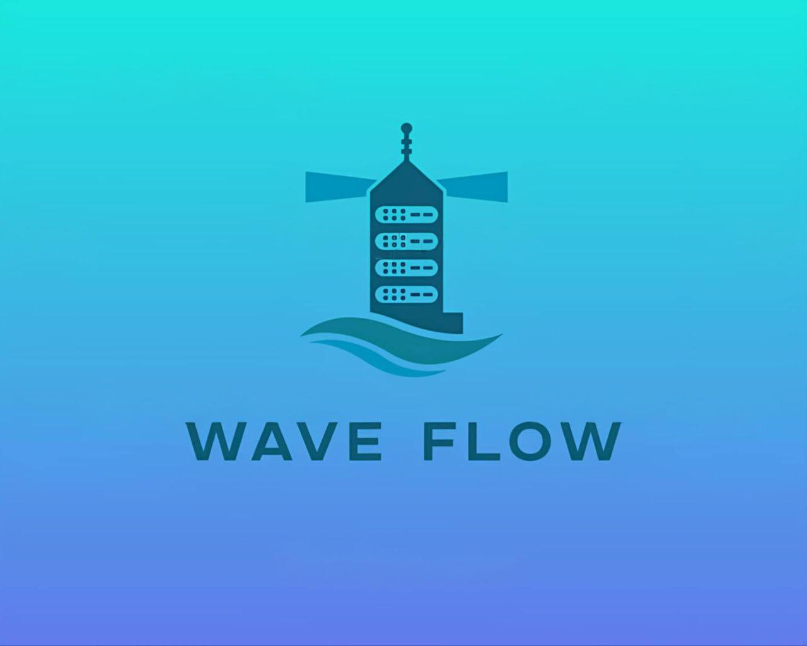

# 🌊 WAVE FLOW - Secure File Sharing System

<div align="center">



**A secure client-server file sharing application with end-to-end encryption**

[](https://www.oracle.com/java/)
[](https://openjfx.io/)
[](https://www.sqlite.org/)
[](https://opensource.org/licenses/MIT)

</div>

---

## 📚 Academic Information

| Field | Details |
|-------|---------|
| **Course** | Réseau Communication (Network Communication) |
| **University** | Mohamed Khider University, Biskra - Algeria |
| **Year** | 2024 |
| **Level** | Master 1 |

---

## 👥 Team Members

| # | Name | Role |
|---|------|------|
| 1 | **ASSASSI Salah Eddine** | Team Leader |
| 2 | **BEKKARI Abderrahmane** | Developer |
| 3 | **NOUAR Elmouataz Billah** | Developer |
| 4 | **MEFTAH Abderrahim** | Developer |
| 5 | **AZRI Mohamed** | Developer |

---

## � Development Timeline

| Milestone | Date |
|-----------|------|
| **Project Start** | November 4, 2024 |
| **Project Completion** | December 8, 2024 |
| **Total Duration** | 5 weeks |

---

## �📖 About

**WAVE FLOW** is a secure client-server file sharing system developed as a mini-project for the Network Communication course. The application enables users to securely upload, download, and share files with comprehensive encryption, integrity verification, and virus scanning capabilities.

### ✨ Key Features

- **🔐 End-to-End Encryption**
  - AES-256 symmetric encryption for file transfers
  - RSA-2048 asymmetric encryption for key exchange
  - SHA-256 hashing for password storage and file integrity

- **🛡️ Virus Protection**
  - ClamAV integration (Linux)
  - Windows Defender integration (Windows)
  - VirusTotal API fallback (Optional - requires API key)

- **📁 File Management**
  - Upload files to personal storage
  - Download files with progress tracking
  - Advanced download from shared files
  - Public/Private file visibility control
  - File removal functionality

- **👤 User Management**
  - Secure user registration and authentication
  - Session management with timeout (5 minutes)
  - Command history logging

- **📊 Real-time Progress**
  - Transfer speed display
  - Remaining time estimation
  - Visual progress indicators

---

## 🖼️ Screenshots

<div align="center">

### Home Screen


### Download Interface


### Transfer Progress


### Command History


</div>

---

## 🏗️ Architecture

### System Architecture

```
┌─────────────────┐                    ┌─────────────────┐
│   Client GUI    │◄──── TCP/IP ──────►│     Server      │
│   (JavaFX)      │     Port 5000      │   (Multi-thread)│
└────────┬────────┘                    └────────┬────────┘
         │                                      │
         ▼                                      ▼
┌─────────────────┐                    ┌─────────────────┐
│  Local Storage  │                    │ SQLite Database │
│  ~/RCtests/     │                    │  + File Storage │
└─────────────────┘                    └─────────────────┘
```

### UML Diagrams

#### Use Case Diagram


#### Class Diagram


#### Sequence Diagram


---

## 🛠️ Prerequisites

Before running WAVE FLOW, ensure you have the following installed:

- **Java Development Kit (JDK)** 21 or higher
- **JavaFX SDK** 21 or higher
- **Eclipse IDE** (recommended) or any Java IDE
- **ClamAV** (Linux only - for virus scanning)

---

## ⚙️ Configuration

### Client Configuration

Edit `Client_GUI/src/application/AppConst.java`:

```java
public static final String SERVER_ADDRESS = "localhost";  // Server IP
public static final int SERVER_PORT = 5000;               // Server Port
```

### Server Configuration

Edit `Server/src/server/AppConst.java`:

```java
public static final String PATH_PROJECT = System.getProperty("user.home") + "/RCtests";
public static final String PATH_SERVER = PATH_PROJECT + "/Server_storage";
```

### VirusTotal API (Optional)

To enable VirusTotal virus scanning:

1. Create an account at [https://www.virustotal.com/](https://www.virustotal.com/)
2. Obtain your API key from the account settings
3. Edit `Server/src/server/AppConst.java`:

```java
public static String API_KEY = "YOUR_API_KEY_HERE";
```

---

## 🚀 Installation & Running

### 1. Clone the Repository

```bash
git clone https://github.com/AssassiSalah/RC-MiniProji-Client-Server.git
cd RC-MiniProji-Client-Server
```

### 2. Import Projects into IDE

1. Open Eclipse (or your preferred IDE)
2. Import `Server` as a Java project
3. Import `Client_GUI` as a JavaFX project
4. Add the required JAR files from the `jars/` folder to both projects

### 3. Add External Libraries

Add the following JARs from the `jars/` folder to your build path:
- `commons-logging-1.2.jar`
- `commons-net-3.11.1.jar`
- `gson-2.10.1.jar`
- `httpasyncclient-4.1.4.jar`
- `httpclient-4.5.13.jar`
- `httpcore-4.4.13.jar`
- `httpcore-nio-4.4.13.jar`
- `httpmime-4.5.13.jar`
- `json-20210307.jar`
- `unirest-java-3.14.5.jar`

### 4. Run the Server

```
Run: Server/src/server/Main_Server.java
```

### 5. Run the Client

```
Run: Client_GUI/src/application/Main.java
```

---

## 📋 Supported Commands

| Command | Description |
|---------|-------------|
| `LOG_IN` | Authenticate user |
| `REGISTER` | Create new account |
| `UPLOAD` | Upload file to server |
| `DOWNLOAD` | Download personal file |
| `ADVANCE_DOWNLOAD` | Download shared file |
| `LIST_FILES_USER` | List personal files |
| `LIST_FILES_SHARED` | List public files |
| `CHANGE_VISIBILITY` | Toggle file public/private |
| `REMOVE` | Delete file from server |
| `EXIT` | Disconnect from server |

---

## 📂 Project Structure

```
RC-MiniProji-Client-Server/
├── Client_GUI/
│   ├── src/
│   │   ├── application/      # Main app & constants
│   │   ├── controller/       # UI controllers
│   │   ├── interfaces/       # FXML & CSS files
│   │   ├── protocol/         # Network communication
│   │   ├── image/            # App icons
│   │   └── web/photo/        # Screenshots
│   └── bin/                  # Compiled classes
├── Server/
│   ├── src/
│   │   ├── application/      # Server UI (optional)
│   │   ├── server/           # Core server logic
│   │   ├── check_virus/      # Virus scanning
│   │   ├── spicy/            # User management
│   │   └── util/             # Utilities
│   └── bin/                  # Compiled classes
├── Diagrams/                 # UML diagrams
├── Report/                   # Project documentation
├── jars/                     # External libraries
└── README.md
```

---

## 🔒 Security Implementation

### Encryption Flow

```
1. Client connects to Server
2. User authenticates (username + SHA-256 hashed password)
3. Server sends RSA-2048 public key
4. Client generates AES-256 key + IV
5. Client encrypts AES key with server's RSA public key
6. Client sends encrypted AES key to server
7. Server decrypts AES key with RSA private key
8. All subsequent file transfers use AES-256 encryption
```

### File Integrity

- Every file transfer includes SHA-256 hash verification
- Files are scanned for viruses after upload
- Corrupted transfers are automatically rejected

---

## 📜 License

This project is licensed under the MIT License - see the [LICENSE](LICENSE) file for details.

---

<div align="center">

**Made with ❤️ by the WAVE FLOW Team**

*Mohamed Khider University, Biskra - 2024*

</div>

---
---

<div dir="rtl" align="right">

#  WAVE FLOW - نظام مشاركة الملفات الآمن🌊

<div align="center">


**تطبيق مشاركة ملفات خادم-عميل آمن مع تشفير من طرف إلى طرف**

[](https://www.oracle.com/java/)
[](https://openjfx.io/)
[](https://www.sqlite.org/)
[](https://opensource.org/licenses/MIT)

</div>

---

## 📚 المعلومات الأكاديمية

| الحقل | التفاصيل |
|-------|---------|
| **المقياس** | شبكات الاتصال |
| **الجامعة** | جامعة محمد خيضر، بسكرة - الجزائر |
| **السنة** | 2024 |
| **المستوى** | ماستر 1 |

---

## 👥 أعضاء الفريق

| # | الاسم | الدور |
|---|------|------|
| 1 | **عساسي صلاح الدين** | قائد الفريق |
| 2 | **بكاري عبد الرحمان** | مطور |
| 3 | **نوار المعتز بالله** | مطور |
| 4 | **مفتاح عبد الرحيم** | مطور |
| 5 | **عزري محمد** | مطور |

---

## � الجدول الزمني للتطوير

| المرحلة | التاريخ |
|---------|--------|
| **بداية المشروع** | 4 نوفمبر 2024 |
| **انتهاء المشروع** | 8 ديسمبر 2024 |
| **المدة الإجمالية** | 5 أسابيع |

---

## �📖 حول المشروع

**WAVE FLOW** هو نظام مشاركة ملفات آمن من نوع خادم-عميل تم تطويره كمشروع مصغر لمقياس شبكات الاتصال. يمكّن التطبيق المستخدمين من رفع وتحميل ومشاركة الملفات بشكل آمن مع تشفير شامل والتحقق من السلامة وفحص الفيروسات.

### ✨ الميزات الرئيسية

- **🔐 التشفير من طرف إلى طرف**
  - تشفير AES-256 المتماثل لنقل الملفات
  - تشفير RSA-2048 غير المتماثل لتبادل المفاتيح
  - تجزئة SHA-256 لتخزين كلمات المرور والتحقق من سلامة الملفات

- **🛡️ الحماية من الفيروسات**
  - تكامل ClamAV (لينكس)
  - تكامل Windows Defender (ويندوز)
  - واجهة VirusTotal API كخيار احتياطي (اختياري - يتطلب مفتاح API)

- **📁 إدارة الملفات**
  - رفع الملفات إلى التخزين الشخصي
  - تحميل الملفات مع تتبع التقدم
  - تحميل متقدم من الملفات المشتركة
  - التحكم في رؤية الملفات (عام/خاص)
  - وظيفة حذف الملفات

- **👤 إدارة المستخدمين**
  - تسجيل ومصادقة آمنة للمستخدمين
  - إدارة الجلسات مع مهلة (5 دقائق)
  - تسجيل سجل الأوامر

- **📊 التقدم في الوقت الحقيقي**
  - عرض سرعة النقل
  - تقدير الوقت المتبقي
  - مؤشرات تقدم مرئية

---

## �️ لقطات الشاشة

<div align="center">

### الشاشة الرئيسية


### واجهة التحميل


### تقدم النقل


### سجل الأوامر


</div>

---

## 🏗️ البنية المعمارية

### بنية النظام

```
┌─────────────────┐                    ┌─────────────────┐
│   واجهة العميل   │◄──── TCP/IP ──────►│     الخادم      │
│   (JavaFX)      │   المنفذ 5000      │  (متعدد الخيوط) │
└────────┬────────┘                    └────────┬────────┘
         │                                      │
         ▼                                      ▼
┌─────────────────┐                    ┌─────────────────┐
│ التخزين المحلي  │                    │ قاعدة بيانات    │
│  ~/RCtests/     │                    │ SQLite + ملفات  │
└─────────────────┘                    └─────────────────┘
```

### مخططات UML

#### مخطط حالات الاستخدام


#### مخطط الفئات


#### مخطط التسلسل


---

## �🛠️ المتطلبات الأساسية

قبل تشغيل WAVE FLOW، تأكد من تثبيت ما يلي:

- **Java Development Kit (JDK)** الإصدار 21 أو أعلى
- **JavaFX SDK** الإصدار 21 أو أعلى
- **Eclipse IDE** (موصى به) أو أي بيئة تطوير Java
- **ClamAV** (لينكس فقط - لفحص الفيروسات)

---

## ⚙️ الإعدادات

### إعدادات العميل

عدّل ملف `Client_GUI/src/application/AppConst.java`:

```java
public static final String SERVER_ADDRESS = "localhost";  // عنوان IP الخادم
public static final int SERVER_PORT = 5000;               // منفذ الخادم
```

### إعدادات الخادم

عدّل ملف `Server/src/server/AppConst.java`:

```java
public static final String PATH_PROJECT = System.getProperty("user.home") + "/RCtests";
public static final String PATH_SERVER = PATH_PROJECT + "/Server_storage";
```

### VirusTotal API (اختياري)

لتفعيل فحص الفيروسات عبر VirusTotal:

1. أنشئ حساباً في [https://www.virustotal.com/](https://www.virustotal.com/)
2. احصل على مفتاح API من إعدادات الحساب
3. عدّل ملف `Server/src/server/AppConst.java`:

```java
public static String API_KEY = "ضع_مفتاح_API_هنا";
```

---

## 🚀 التثبيت والتشغيل

### 1. استنساخ المستودع

```bash
git clone https://github.com/AssassiSalah/RC-MiniProji-Client-Server.git
cd RC-MiniProji-Client-Server
```

### 2. استيراد المشاريع إلى بيئة التطوير

1. افتح Eclipse (أو بيئة التطوير المفضلة لديك)
2. استورد `Server` كمشروع Java
3. استورد `Client_GUI` كمشروع JavaFX
4. أضف ملفات JAR المطلوبة من مجلد `jars/` لكلا المشروعين

### 3. إضافة المكتبات الخارجية

أضف ملفات JAR التالية من مجلد `jars/` إلى مسار البناء:
- `commons-logging-1.2.jar`
- `commons-net-3.11.1.jar`
- `gson-2.10.1.jar`
- `httpasyncclient-4.1.4.jar`
- `httpclient-4.5.13.jar`
- `httpcore-4.4.13.jar`
- `httpcore-nio-4.4.13.jar`
- `httpmime-4.5.13.jar`
- `json-20210307.jar`
- `unirest-java-3.14.5.jar`

### 4. تشغيل الخادم

```
شغّل: Server/src/server/Main_Server.java
```

### 5. تشغيل العميل

```
شغّل: Client_GUI/src/application/Main.java
```

---

## 📋 الأوامر المدعومة

| الأمر | الوصف |
|---------|-------------|
| `LOG_IN` | مصادقة المستخدم |
| `REGISTER` | إنشاء حساب جديد |
| `UPLOAD` | رفع ملف إلى الخادم |
| `DOWNLOAD` | تحميل ملف شخصي |
| `ADVANCE_DOWNLOAD` | تحميل ملف مشترك |
| `LIST_FILES_USER` | عرض الملفات الشخصية |
| `LIST_FILES_SHARED` | عرض الملفات العامة |
| `CHANGE_VISIBILITY` | تبديل الملف بين عام/خاص |
| `REMOVE` | حذف ملف من الخادم |
| `EXIT` | قطع الاتصال بالخادم |

---

## 📂 هيكل المشروع

```
RC-MiniProji-Client-Server/
├── Client_GUI/
│   ├── src/
│   │   ├── application/      # التطبيق الرئيسي والثوابت
│   │   ├── controller/       # متحكمات الواجهة
│   │   ├── interfaces/       # ملفات FXML و CSS
│   │   ├── protocol/         # الاتصال الشبكي
│   │   ├── image/            # أيقونات التطبيق
│   │   └── web/photo/        # لقطات الشاشة
│   └── bin/                  # الملفات المترجمة
├── Server/
│   ├── src/
│   │   ├── application/      # واجهة الخادم (اختياري)
│   │   ├── server/           # منطق الخادم الأساسي
│   │   ├── check_virus/      # فحص الفيروسات
│   │   ├── spicy/            # إدارة المستخدمين
│   │   └── util/             # الأدوات المساعدة
│   └── bin/                  # الملفات المترجمة
├── Diagrams/                 # مخططات UML
├── Report/                   # وثائق المشروع
├── jars/                     # المكتبات الخارجية
└── README.md
```

---

## 🔒 تنفيذ الأمان

### تدفق التشفير

```
1. يتصل العميل بالخادم
2. مصادقة المستخدم (اسم المستخدم + كلمة المرور المجزأة بـ SHA-256)
3. يرسل الخادم المفتاح العام RSA-2048
4. ينشئ العميل مفتاح AES-256 + IV
5. يشفر العميل مفتاح AES بالمفتاح العام RSA للخادم
6. يرسل العميل مفتاح AES المشفر إلى الخادم
7. يفك الخادم تشفير مفتاح AES بالمفتاح الخاص RSA
8. جميع عمليات نقل الملفات اللاحقة تستخدم تشفير AES-256
```

### سلامة الملفات

- كل عملية نقل ملفات تتضمن التحقق من تجزئة SHA-256
- يتم فحص الملفات بحثاً عن الفيروسات بعد الرفع
- يتم رفض عمليات النقل التالفة تلقائياً

---

## 📜 الترخيص

هذا المشروع مرخص بموجب رخصة MIT - راجع ملف [LICENSE](LICENSE) للتفاصيل.

---

<div align="center">

**صُنع بـ ❤️ من فريق WAVE FLOW**

*جامعة محمد خيضر، بسكرة - 2024*

</div>

</div>
